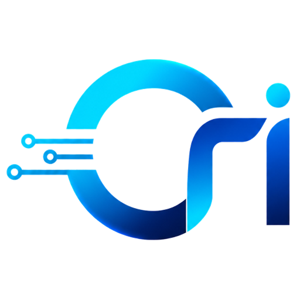

<div align="center">
  

# Ori Software Solutions

אתר תדמית עסקי בעברית (RTL) — פתרונות תוכנה שמתחילים מכאב אמיתי ונגמרים במוצר שעובד.

**Next.js 16 · TypeScript · Tailwind CSS 4 · Framer Motion**

</div>

## מה יש כאן

- **אתר One-Page** — הירו מונפש, גלריית פרויקטים אמיתיים, תהליך עבודה ויצירת קשר בוואטסאפ
- **חידוש יומי** (`/til`) — יומן למידה ציבורי: כל יום תובנה אחת, עם קישור מושגים אוטומטי בין חידושים (ויקי-למידה שבונה את עצמו)
- **החלטות מנומקות** — כל החלטה ארכיטקטונית מתועדת כ-ADR: ראו [ARCHITECTURE.md](ARCHITECTURE.md)

## נקודות עניין הנדסיות

| מה | איפה | למה |
|---|---|---|
| ולידציית תוכן ב-build עם zod | [lib/til.ts](lib/til.ts) | קובץ תוכן שבור מפיל את ה-build, לא את הפרודקשן |
| קישור מושגים אוטומטי | [lib/til.ts](lib/til.ts) | חידוש שמזכיר מושג שהוסבר בעבר מקבל לינק אליו — בלי תחזוקה |
| כותרות אבטחה (CSP, HSTS...) | [next.config.ts](next.config.ts) | עקרון ההרשאה המינימלית, גם באתר סטטי |
| אתר סטטי מלא (SSG) | כל העמודים | סקייל של CDN, שטח תקיפה מזערי |

## הרצה

```bash
npm install
npm run dev     # http://localhost:3000
npm run build   # build פרודקשן (כולל ולידציית תוכן)
```

## מבנה

```
app/            עמודים (App Router) — הבית, /til, /til/[slug]
components/     קומפוננטות UI + framer-motion
content/til/    חידושים יומיים (Markdown + frontmatter)
lib/            site.ts (קונפיג מרכזי) · til.ts (שכבת תוכן)
public/         נכסי מותג
```

---

<div align="center">

נבנה מאפס. בלי תבניות. · [oriIsrael856](https://github.com/oriIsrael856)

</div>
